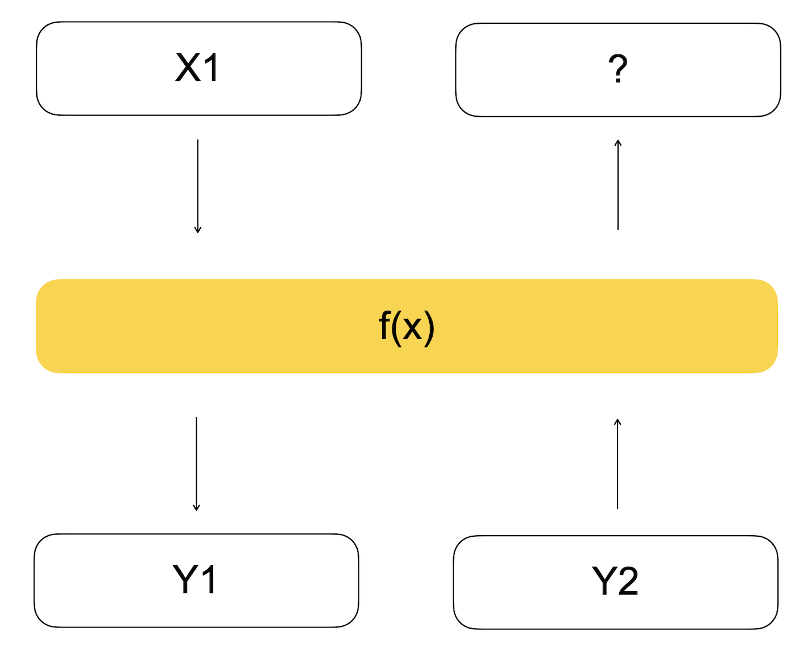
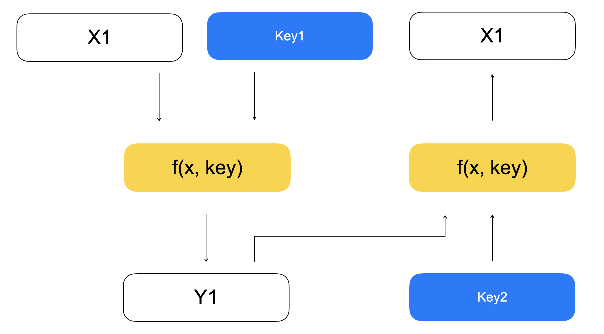
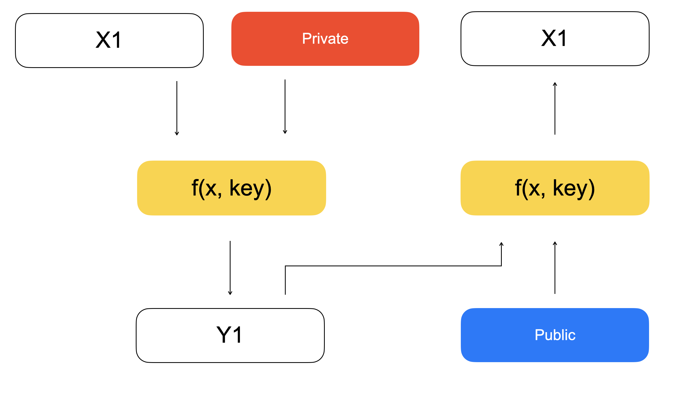
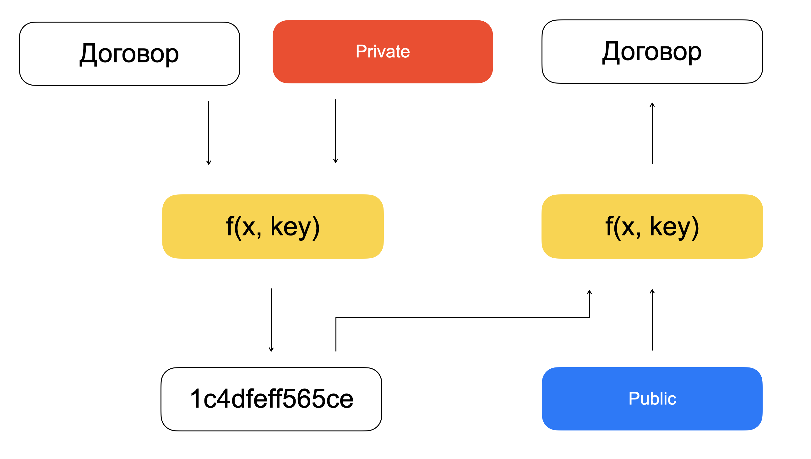
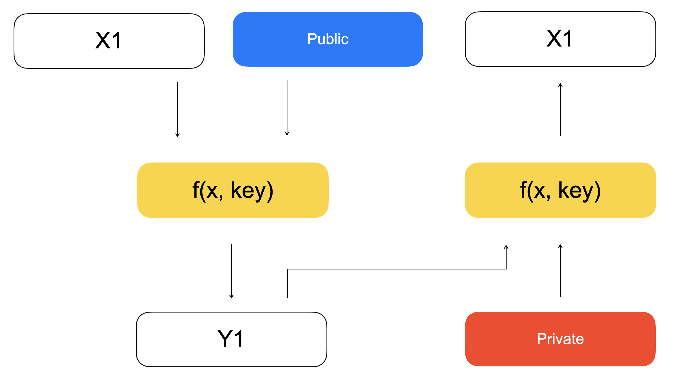
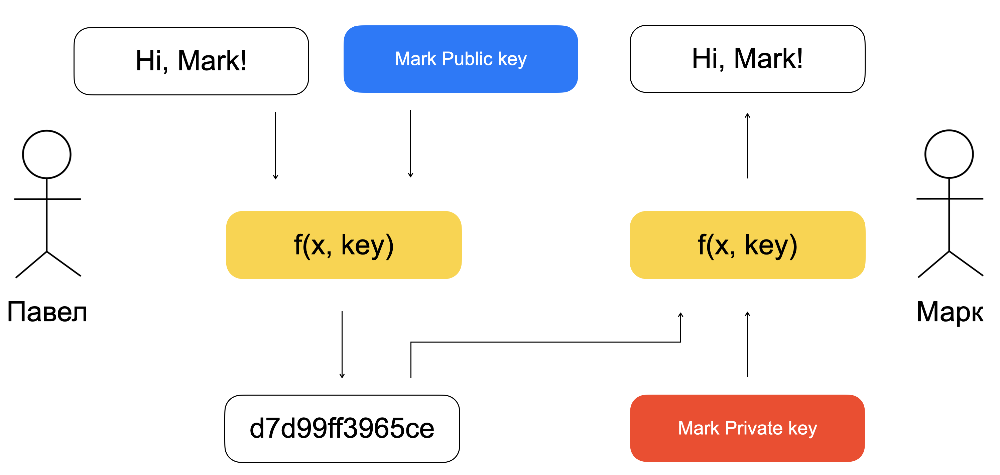
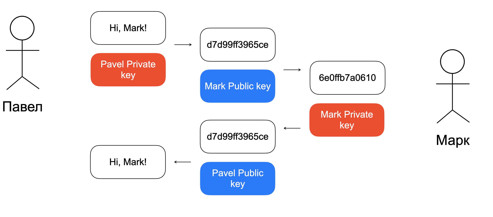
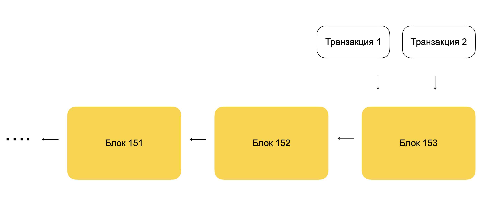
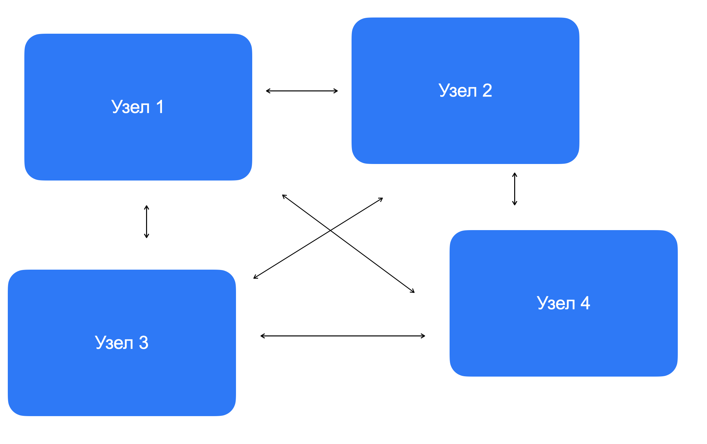
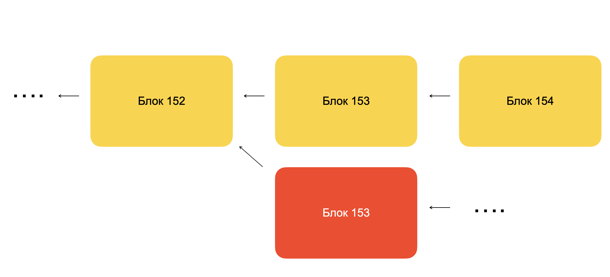

Решил немного написать о развитии блокчейна на текущий момент доступным языком. Начать придется с криптографии, затем о теоретических основах блокчена. После поговорим о первых блокченах и их развитии. И завершим необычным - приватными блокчейнами.<!--truncate-->

# Криптография

Основа криптографии - это _одностороняя функция_. Это функция, которую легко вычислить в одном направлении и сложно в обратном (легко подставить переменную и найти результат, но сложно, зная результат, вычислить подставленную переменную).

Ученых по криптографии условно можно разделить на две части: те кто ищет такие функции, и тех кто пытается такие функции взломать.

Каждое государство определяет какую функцию использовать для криптографических нужд государства, например для электронно-цифровых подписей. Глобальная проблема в том, что у каждой страны эта функция своя, что затрудняет признание подписи в других странах.

Такие функции используются в так называемом ассиметричном шифровании. Суть ассиметричного шифрования заключается в использовании двух связанных ключей с односторонней функцией. Ключи связаны следующим образом: если один ключ передавать в одностороннюю функцию с данными (зашифровать их), то расшифровать данные можно применив функцию со вторым ключом.

В криптографии принято называть один ключ открытый или публичный, второй - закрытый или приватный. Открытый ключ доступен всем, закрытый - только владельцу.

Типичным примером применения ассиметричного шифрования является электронно-цифровая подписть, ЭЦП: некое лицо шифрует договор своим приватным ключом и отправляет полученное сообщение в общий доступ. Любой желающий может расшифровать доступное сообщение с помощью публичного ключа этого лица.

Бывает, что для шифрования применяется публичный ключ. Зачем это нужно?!

В такой схеме, зашифровать сообщение может любой человек (т.к. публичный ключ доступен всем), а расшифровать только владелец приватного ключа. Такое применяется, когда необходимо отправить сообщение, которое сможет прочитать только конкретный человек.

В такой схеме, к сожалению, нельзя понять кто является отправителем сообщения. А хотел бы отправлять сообщения между двумя участниками так, чтобы получатель был уверен, что прочитать сообщение сможет только получатель, а получатель был уверен, что отправит сообщение отправитель.

Такую схему тоже можно организовать с помощью ассиметричного шифрования и называется это end to end encryption (e2e).

Работает это следующим образом. Павел (П) хочет отправить сообщение Марку (М). Он шифрует сообщение (S) своим приватным ключом и получает сообщение S'. Если S' отправить по сети, расшифровать его сможет любой человек, т.к. публичный ключ П доступен всем. Поэтому П шифрует S' публичным ключом Марка и получает сообщение S'', которое и отправляет в сеть. Расшифровать сообщение S'' может только М, т.к. для этого нужен приватный ключ М. После применения приватного ключа М, получаем сообщение S', которое можно расшифровать публичным ключом П. Таким образом П точно знает, что расшифровать сообщение может только М, а М точно знает, что отправил его П.

В одних из самых популярных мессенджерах WhatsApp и Telegram есть e2e-encryption. В WhatsApp вся переписка по умолчанию шифруется e2e, а в Telegram этим можно воспользоваться с помощью так называемых секретных чатов. Именно поэтому, при смене телефона, после входа в свой профиль в Telegram вся переписка тут же доступна, а в WhatsApp нужно сохранять историю во внешнем хранилище, и выкачивать ее на новый телефон для доступности всей переписки.

## Блокчейн

**Блокчейн** - это технология децентрализованного хранения данных.
_Децентрализованное_ - означает, что в ней нет центрального узла. При отказе одного из узла, сеть блокчейна продолжит работать.
Это _технология_, т.е. описание работы, а не что-то физическое. На основе этого описания можно создать программное обеспечение, которое будет работать автономно. Естественно, уже существуют множество ПО, реализующую эту технологию.
Основной смысл этой технологии - _хранение данных_.

Далее, для краткости, если в тексте встречается слово Блокчейн (с большой буквы), означает, что мы говорим о технологии, а блокчейн (с маленькой буквы), что о ее реализации в виде ПО.

Немного о том, как это работает...

Блокчейн переводится как цепочка блоков (block chain). При запуске блокчейна, эта программа начинает принимать транзакции. Транзакция - это подписанное ассиметричным шифрованием сообщение, в котором содержится новые данные или изменение уже сохраненных в блокчейне данных. Сам блокчейн проверяет валидность подписи транзакции, а также права доступа на сохранение или изменение этих данных у отправившего транзакцию. блокчейн собирает в течении определенного времени эти транзакции в блок, а после подписывает ассиметричным шифрованием получившийся блок. В получившийся блок добавляют ссылку на предыдущий блок. Так и получается цепочка блоков. Зная адрес текущего блока, можно получить предыдущий блок с прошлыми транзакциями. Проделывая это рекурсивно, можно получить всю историю изменений в блокчейне.

Децентрализация достигается увеличением количеств узлов, т.е. компьютеров, на которых запущен блокчейн. Эти узлы общаются между собой, пересылая транзакции и с помощью консенсуса определяют какой блок следует сохранить всем узлам.

Так блокчейн хранит все изменения данных, а также кто эти изменения производил. Совершить изменения задним числом не получится. Даже если физически поменять какой-то блок в прошлом, он, во-первых, не будет проходить криптографическую проверку, во-вторых, изменится ссылка на него, что потребует изменить все следующие за ним блоки. Если узлов много и они действительно независимы, то вероятность этого стремится к нулю.

### Плюсы и минусы Блокчейна

Из плюсов Блокчейна можно отметить:

- Доступность сервиса. Если один узел пропадет из сети, блокчейн продолжит функционировать, и пользователи будут пользоваться другими узлами.
- Сохранность данных. Данные хранятся на всех узлах в виде цепочки блоков. Если произойдет сбой в оборудовании одного узла, информация будет доступна на других.
- Неизменность данных. Все изменения данных проходят криптографическую проверку.
- Децентрализация. Все узлы независимы и не требуют доверия друг к другу.

А из минусов:

- скорость работы. Для координации все узлов требуется время.

Но все не так просто.

Если говорить про доступность сервиса, то Блокчейн как технология выходит намного дороже, чем другие доступные нам технологии обеспечивающие аналогичную доступность данных. блокчейн состоящий из 10 узлов, означает 10 компьютеров доступных для приема транзакций. Однако, на высоконагруженных сервисам достаточно и 3 узлов для высокой доступности.

Сохранность данных в Блокчейна обеспечивается ее дублированием. 10 узлов, означает что для сохранения 1Гб данных, мы используем 10 Гб дискового пространства. Используя разные технологии резервирования, достаточно от 1.3 до 2 Гб дискового пространства для полной сохранности информации.

Если говорить про неизменность данных, то ситуация аналогичная: существует технологии более дешевые, чем Блокчейн, обеспечивающие неизменность данных.

Однако, в децентрализации у Блокчейна нет аналогов. Именно поэтому, основной критерий выбора блокчейна для хранения данных, является именно децентрализация.

# Публичные блокчейны

### Bitcoin

Bitcoin - первый блокчейн проект, созданный людьми, разочаровавшимся в финансовой системе Мира (и США в частности), после кризиса 2008 года. Цель bitcoin-а создать независимую, децентрализованную финансовую сеть.

- В bitcoin хранятся адреса и количество монет на них. Адрес - это публичный ключ, а количество монет - простое число.
- Первый блок был сформирован в 2009 году.
- Весь блокчейн bitcoin-а занимает > 480 Гб на жестком диске.
- Блок создается каждые 10 минут.
- Количество узлов ~47 000 (зафиксированный максимум ~200 000)

По сегодняшний день, считается самым децентрализованным блокчейном. Но со временем, пользователям стало мало простого блокчейна для перевода монет.

### Ethereum

Ethereum - хранит не только адреса с балансами, но и программный код (смарт-контракт), который может манипулировать этими данными. Можно написать программу на специальном языке программирования (Solidity) и сохранить в блокчейне, так называемом смарт-контракте. Сохраненный смарт-контракт можно запустить. Запуск происходит так: вы формируете специальную транзакцию и отправляете на любой узел сети. Узел выполняет код, который меняет данные, и сохраняет изменения этих данных. В блок помещается информация о запуске и измененных данных. При проверке блока, каждый узел запускает смарт-контракт для проверки измененных данных. Именно поэтому, эта штука не дешевая. Хранить большой объем данных в блокчейне - дорого. Также дорого делать большие, трудозатратные вычисления.

- первый блок был добыт в 2015 году
- весь блокчейн занимает > 1 Tб дискового пространства.
- блок создается каждые 13.5 секунд
- ~11 000 узлов

Запуск такого блокчейна породило цепочку идеологических движений и проектов.

### Decentralized Autonomous Organization (DAO)

Децентрализованные автономные организации или DAO - это организации, которые функционируют согласно коду смарт-контракта записанного в блокчейне. Децентрализованные, т.к. все возможные процессы этой организации происходят через смарт-контраты на блокчейне. Автономные, т.к. они не подчиняются юридическим законам ни одной страны. Основной принцип таких организаций: **код - это закон**.

Немного примеров

#### The DAO

Это DAO, цель которой собирать инвесторов для совместных инвестиций к криптопроекты. С одной стороны инвесторы, переводят свои средства в этот DAO (с каждого по нитке), с другой крипто-стартапы ищущие инвестиций подают заявки в DAO. Инвесторы могут изъявить желание проинвестировать, если собранную сумму стартап готов принять.

История этого DAO печальна: в его смарт-контракте был обнаружен баг, которым воспользовался злоумышленник и вывел все средства инвесторов на свой адрес.

#### Steemit

Это социальная сеть на блокчейне. Пользователи регистрируются в ней, пишут посты, лайкают понравившиеся. Самые залайканные посты получают вознаграждения в виде токенов. Этот DAO до сих пор функционирует.

#### MakerDAO

DAO создающий токен DAI с фиксированной ценой в 1$. Благодаря MakerDAO, любой адрес может создать 100 DAI (== 100$), отправив в смарт-контракт ethereum-монеты по стоимости 200$ (задепонировать) на сколь угодно долгое время. Чтобы вернуть свои ethereum-монеты, нужно вернуть 100 DAI. Аналог рассрочки без срока возврата.

Создание токенов со стабильной ценой, породило новую ветвь развития.

### Decentralized Finance (DeFi)

Появление токенов с децентрализованной и стабильной ценой (DAI) позволило начать строить децентрализованные финансовые DAO, привычные нам в централизованном мире.

#### Compound

Выдача займов под залог криптовалют. Все инвесторы отправляют свои токены в общий пул. Взамен получают определенное количество токенов, которое отражает, какой % в общем пуле занимают средства инвестора. Заемщик берет займ из пула и через какое-то время возвращает больше средств. Таким образом общий пул увеличился, что привело к пропорциональному увеличению средств всех инвесторов.

#### Uniswap

Децентрализованный обмен токенов (по сути биржа). На централизованных биржах работает система заявок: покупатель определяет цену покупки, продавец - цену продажи. Если цены пересекаются, то сделка происходит. На рынке остаются покупатели и продавцы с непересекающимися сделками, образуя "стакан". Для децентрализованной биржи такое сделать проблематично из-за малого количества покупателей и продавцов (проблема ликвидности). Из-за этого спред (разница между минимальной ценой покупки и максимальной ценой продажи) на таких биржах больше, чем на централизованных. Как следствие, люди используют централизованные биржи для обмена, а на децентрализованных ликвидность снижается. Такой вот замкнутый круг.

Но Uniswap удалось это переломить. Они объединяют всех инвесторов в пулы как в Compound, а цена актива А к активу Б определятся размером этих пулов. Когда трейдер покупает актив А за Б, он отдает Б, пополняя его пул, и забирает А из пула. Объем пула А уменьшается, а пула Б - увеличивается. Соотношение этим пулов изменилось, следовательно изменилась и цена. Хорошо...как цена обмена меняется понятно. Но зачем инвесторам пополнять пулы?! Из-за комиссии при обмене, которая примерно равна комиссии на централизованной бирже. Эта комиссия уходит в пул, увеличивая его. Как и в Compound, у инвесторов фиксируются % владения пула. Таким образом, комиссия пропорционально распределяется между всеми инвесторами.

### Non-fungible token (NFT)

Невзаимозаменяемые токены - это токены, каждый экземпляр которой, имеет уникальное сочетание свойств. Например, покупая квартиру (или ее часть) через токены, Вы получаете токены в которой зафиксирован адрес этой самой квартиры.

На практике, NFT в основном используются для оцифровки и продажи предметов искусства. Например, художник рисует картинку, помещает ее в блокчейн выпуская NFT-токен, и уже этот токен может продать другому лицу. Владелец токена, в таком случае, считается владельцем картины.

### Action to Earn

В последнее время очень активно развиваются направления, в которых пользователя награждают токенами за активность. Например, **Play to Earn** применяются в играх, где время потраченное в игре определяет количество токенов, которое тебе будет начислено. Токены используются как игровая валюта. Или **Move to Earn** применяются во всяких фитнес-приложениях, когда начисление токенов связанно с каким-то фитнес занятием. Или **Learn to Earn**, где начисление токенов привязано к процессу обучения чему-либо.

Очень часто в таких проектах, чтобы начать получать токены, необходимо приобрести какой-либо NFT-токен. Например, в **STEPN** (move2earn), нужно купить NFT-кроссовок. После, бег фиксируется приложением и за это начисляются токены.

## Приватные блокчейны

Под приватным блокчейном понимается блокчейн в узлы которого доступкаются только определенный круг лиц, а сами блоки не доступны вне круга узлов. Из-за того, что эти блокчейны закрытые, в публичном поле о них известно очень мало. Но поставщики таких услуг известны:

- [Waves Enterprise](https://wavesenterprise.com/ru/)
- [Hyper Ledger](https://www.hyperledger.org/use/fabric)

Основной критерий использования: потребность в общей базе данных для организаций не доверяющих друг другу.

### Central Bank Digital Currency (CBDC)

Цифровая валюта центрального банка - попытка центробанков создать цифровые аналоги национальных валют. На текущий момент, все CBDC только тестируются. Самых масштабных тестов достиг Китай со своим цифровым юанем. В России происходит закрытое тестирование цифрового рубля, а с 2023 года планируют начать масштабное тестирование на населении. Европейский центральный банк тоже тестирует цифровой евро, но об этом мало что известно.

Как уже упоминалось ранее, основное преимущество блокчейна - децентрализация. В случае с центральными банками государств, которые собираются полностью контролировать цифровые валюты, очевидно, в децентрализации нет особого смысла. Доподлинно не известно, действительно ли в CBDC используется блокчейн. В случае с Китаем и Россией, лично мне кажется, в блокчейне смысла нет. Проще и дешевле создать централизованное ПО с теми же свойствами.
