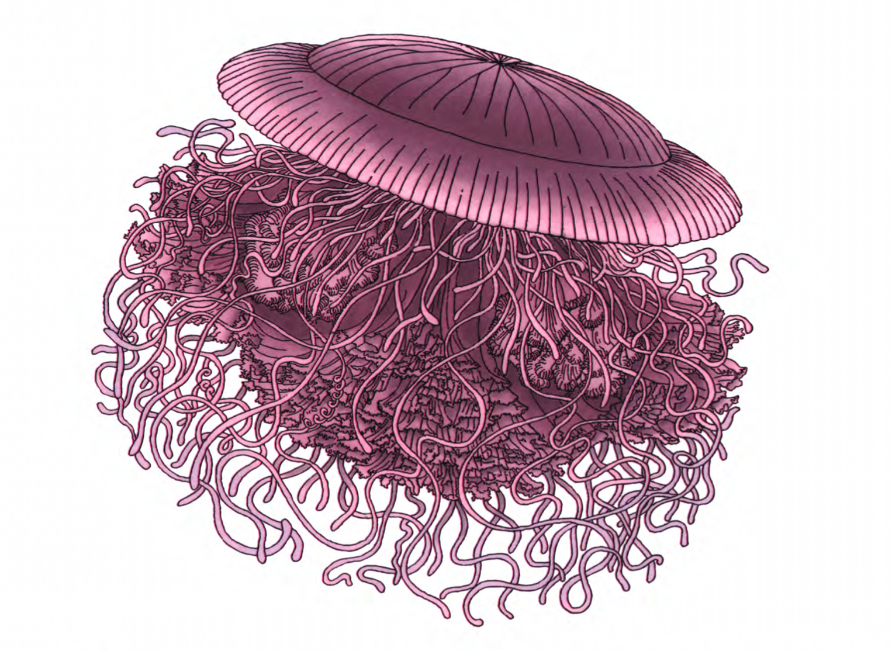
Книга "От монолита к микросервисам" Сэма Ньюмана, вышедшая в 2020 году, как по мне, является хорошим практическим руководством. Для лучшей фиксации в памяти основных моментов книги, решил написать краткую выжимку основной информации этой книги.
<!--truncate-->

## Микросервисная архитектура

**Микросервисы** — это независимо развертываемые службы, моделируемые вокруг бизнес-домена. 

Каждая служба решает определенную задачу в бизнес-домене, например служба обработки заказов, служба склад, служба нотификации и т.д. Разделять на службы можно по-разному. Основной критерий хорошего разделения - это независимость развертывания.

Для примера, давайте представим типичную компанию, продающую музыку. В компании есть три группы разработчиков:
- группа фронтенда, занимающегося веб-интерфейсом для пользователя
- группа backend-разработчиков, занимающиеся приложением работающем на сервере
- группа администраторов, занимающиеся сопровождением баз данных.

Такое разделение, скорее всего приведет к аналогичному разделению владения кода, по закону Конвея:

> "Любая организация, которая строит дизайн системы... неизбежно произведет дизайн, структура которого является копией коммуникационной структуры организации"
> (c) Мелвин Конвей (Melvin Conway)

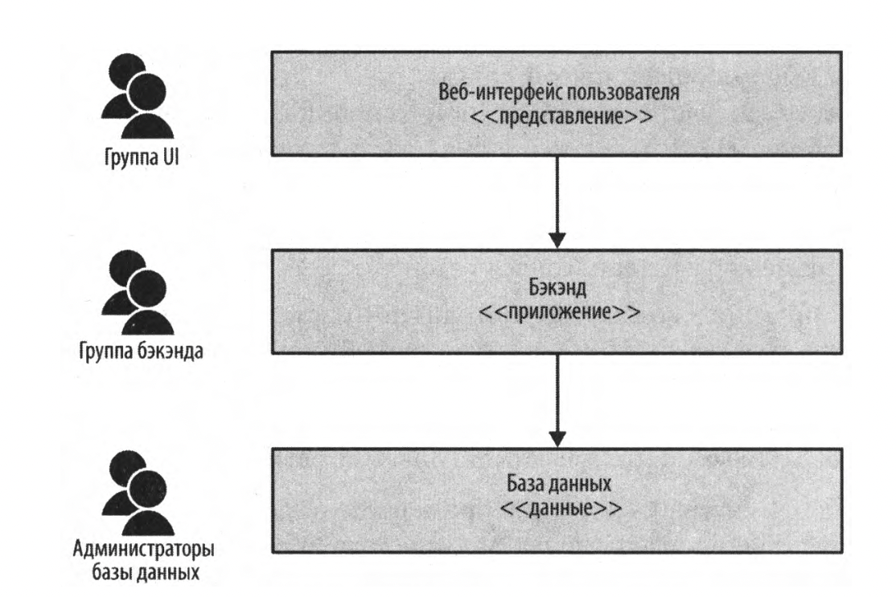

В какой-то момент было решено добавить функционал: пользователи могут указать свой любимый жанр музыки. Для имплементации этого функционала, нам потребуются работа всех трех групп разработки.

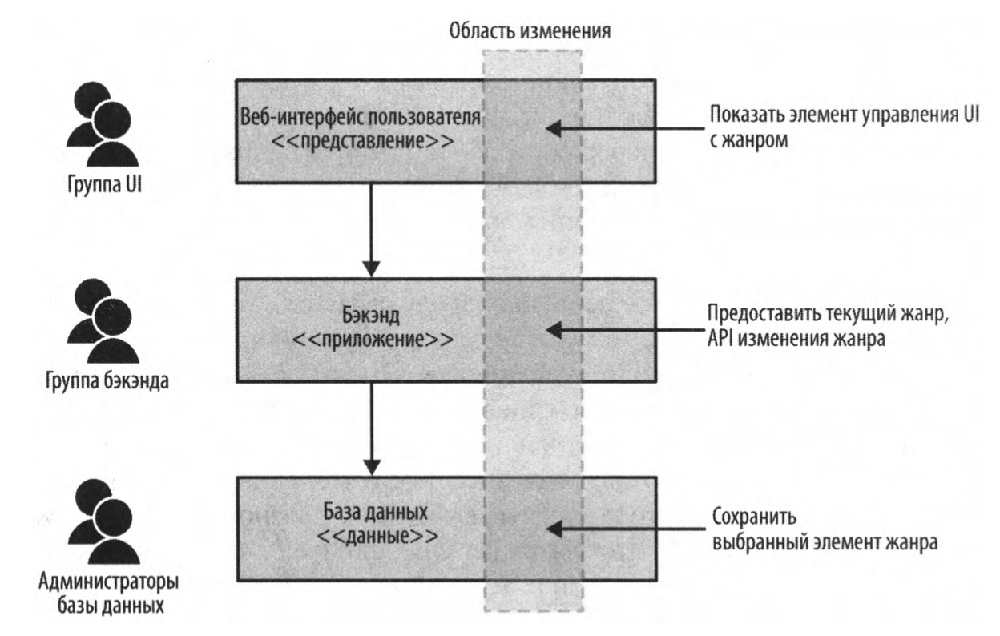

Альтернативно, можно было создать архитектуру наподобие следующей:
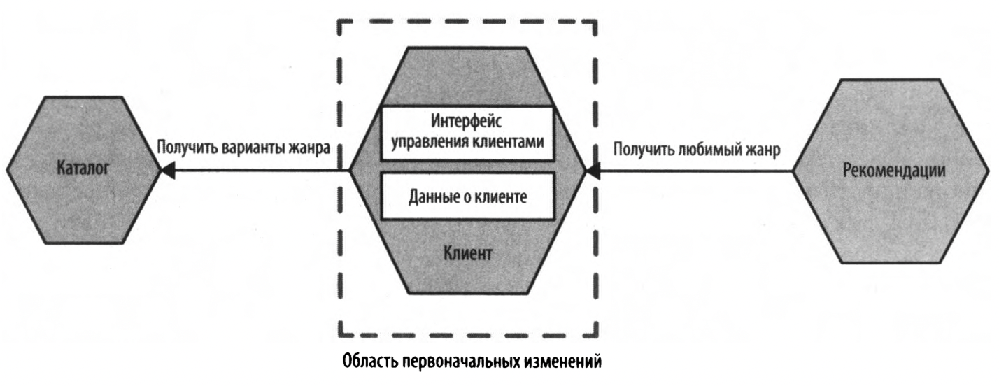

У нас есть сервис **Каталог**, **Клиент** и **Рекомендации**. Сервис **Клинет** в том числе занимается интерфейсом отображения клинетов. Таким образом, изменения затронули бы только один сервис **Клиент**.

При выделении сервисов стоит стремиться, чтобы они обладали следующими свойствам:
1. Независимость развертывания: часто изменяемое внутри сервиса, редко изменяемое - снаружи (API)
2. Строятся вокруг бизнес-домена: внедрение нового функционала должно приводить к изменению минимального количества служб (в идеале одной!)
3. Владеют своими собственными данными: у каждой службы своя база данных, которую можно изменять или мигрировать без согласования с другими.

У монолита и микросервисов есть свои плюсы и минусы. Все их нужно хорошенько взвесить, прежде чем принимать окончательное решение по поводу изменения архитектуры.

### Плюсы и минусы микросервисов

Основные плюсы микросервисов:
- независимость развертывания
- автономия групп разработчиков
- time to market
- эффективное маштабирование
- повышение робастности
- маштабирование числа разработчиков
- просто внедрять новые технологии

Минусы переезда на микросервисы (в сравнее с монолитом):
- частые сетевые сбои
- проблемы нарушение контракта
- тестирование, мониторинг и устранение неполадок: "Мы заменили наш монолит микрослужбами, для того чтобы каждый перебой в работе был больше похож на детективную историю убийства"
- владение кодом: сильная степень владения, слабая степень владения, коллективное владение
- сложности в CI/CD
- зоопарк технологий: глобальная оптимизация против локальной оптимизации
- "осиротевшие" службы

Решения о жертве одного качества в пользу другого лучше всего представить в виде набора ползунковых регуляторов: двигая один регулятор вверх, другие понемного уползают вниз. Нам нужно настроить ползунки так, чтобы нас все устраивало.
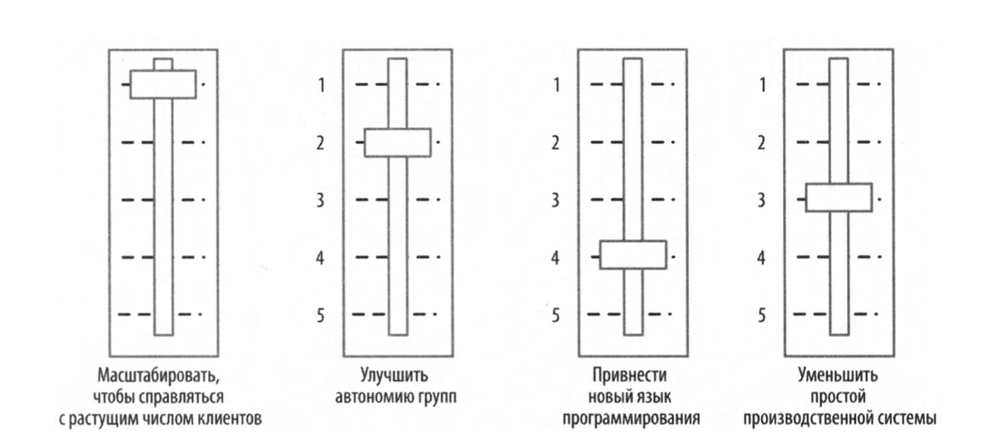

### Вопросы для самоконтроля

Если вы все же решили переписать монолит на микросервисы, стоит задать себе ряд вопросов:
1. Чего вы надеетесь достичь?
2. Подумали ли вы об альтернативах микросервисов?
3. Как вы узнаете, что цель достигнута?

### Когда микросервисы точно плохой выбор?
- **Неясен домен**. Это повлечет за собой только усложение из-за большой сопряженности.
- **Стартапы**. Они еще не нашли точку прибыльности, что влечет за собой частое изменение, в том числе и домена.
- **Софт инсталируется и управляется клиентом**.
- **Отсутствует веская причина**. Не стоит выбирать микросервисы, только из-за того что там сделала успешная компания X.

## Планирование миграции

> "Если вы переписываете методом “Большого взрыва”, то единственное, что вам гарантировано, — это большой взрыв”.
>  Мартин Фаулер (Martin Fowler)

Если мы не хотим, внезапно наткнутся на непредвиденные проблемы, большой монолит лучше распиливать на кусочки, маленькими итерациями, каждый из которых можно было бы откатить в случае проблем.

### С чего же начать при миграции?

Ответить на этот вопрос опять же нам поможет доменно-обусловленный дизайн (Domain Driven Design, DDD). К примеру, представим, что у нас следующая доменно-обусловленная схема монолита:

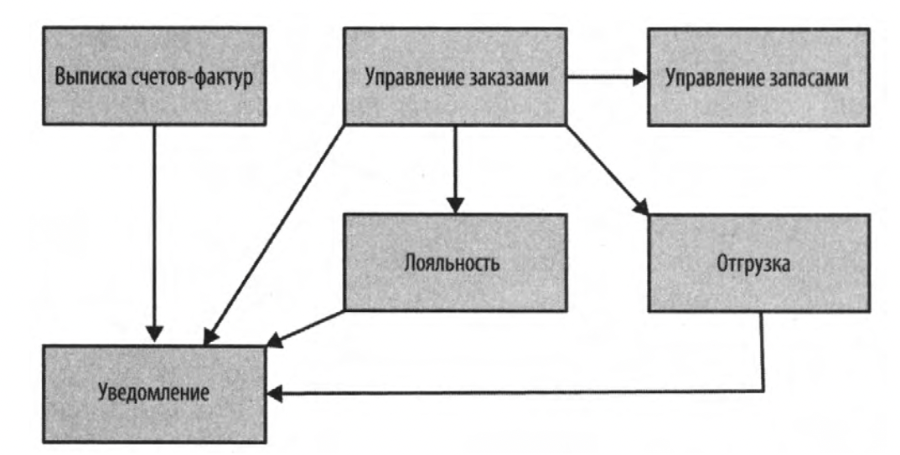

Очевидно, что начинать переписывать систему уведомлений было бы проблематично, т.к. тогда бы пришлось править практически каждый модуль. А вот выписку счет-фактур можно безболезненно вывести в отдельный микросервис.

Но зависимости модулей не единственный критерий по кторому стоит выбирать модуль для выделения в микросервис. Немаловажным критерием является польза этого микросервиса в решении нашей задачи. Отсюда, автор предлагает использовать следующий график:

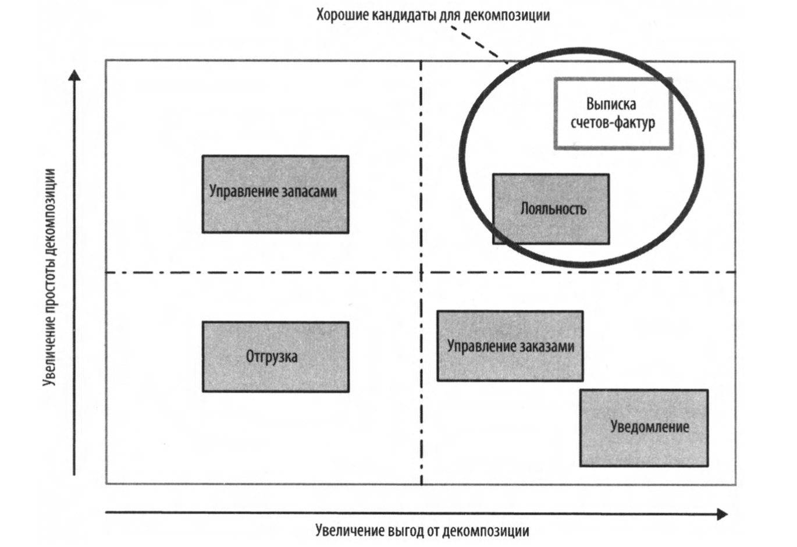

### Миграция кода и данных

Обычно основные проблемы при миграции возникают из-за общего кода и данных монолита, которые мы хотим разделить. Мы может начать мигрировать:
- Сначала смигрировать данные, потом код
- Сначала смигрировать код, потом данные
- начать миграцию все сразу.

Думаю всем понятно, что мигрировать все сразу займет больше времени и потенциально мы можем выявить критический недостаток микросервиса лишь потратив кучу времени и сил. Именно поэтому рекоменуется выбирать что мигрировать раньше: код или данные. 

Выделяя сначала схему, мы можем быстро выявить проблемы при работе с данными, которые потенциально изменят наши планы на разделяемые микросервисы. Причем при выделении базы данных, мы можем использовать туже базу, но обращаться к разным ее схемам.

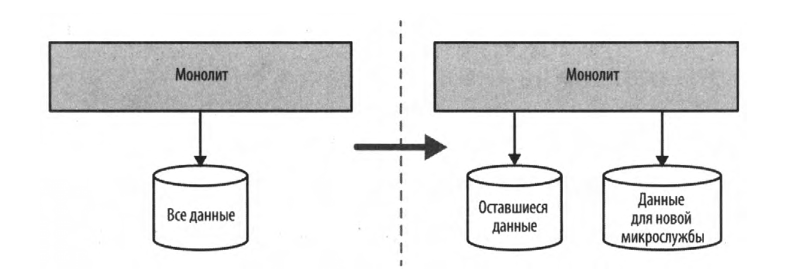

Тем не менее, большинство групп выбирают путь, выделения сначала кода, т.к. это дает более быстрый результат. Это вполне годной способ, если вы не сомневаетесь в том, что с данными будут какие-то проблемы.

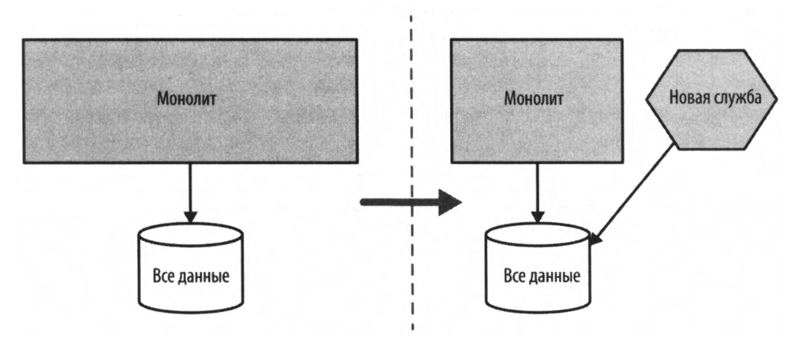

### Контрольные точки

И так, мы выбрали модуль для выделения его в микросервис. Что дальше? 

Нам следует определить текущие свойства нашей системы (так называемые контрольные точки), и предположить на сколько они изменятся при переезде модуля в микросервис. 

К примеру, важные для этого модуля могут быть свойства:
- связность и сопряженность (coupling)
- робастность и отказоустойчивость
- консистентность
- сложность доставки и сопровождения

Как изменять те или иные свойства, команда должна решить сама. К примеру, сопряженность тем меньше, чем быстрее новые фичи доезжают в продакшен среду.

Контрольные точки, также могут быть связаны не с техническими характеристиками, а с отношением команды и компании в целом к выбранному пути. К примеру, у компании могут возникнуть другие приоритеты, и тратить ресурс переход из монолита на микросервисы будет не целесообразно.

## Шаблоны миграции кода

### Фикус-удавка

Название было придумано под впечатлением особого вида фикуса, который поселяется на верхних ветках деревьев, прорастает по стволу на землю, пуская там корни, что убивает прежнее дерево, взамен которого начинает процветать фикус.

В целом, именно так и планируется переносить код из монолита в микросервис: сначала мы переносим функциональность в микросервис, а по мере его готовности переключает входящие запросы с монолита на этот микросервис.
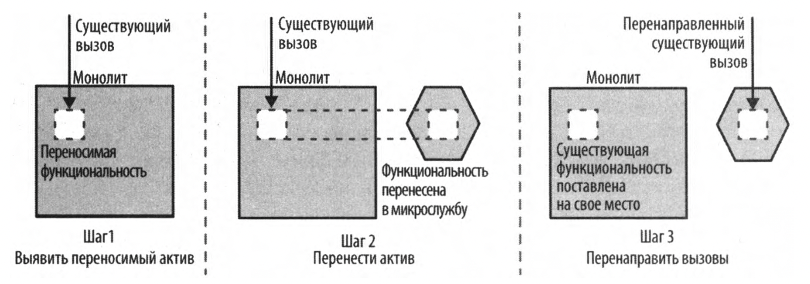

Если микросервис должен использовать функционал, который остается в монолите, то следует организовать API для вызова его из микросервиса. Если микросервису необхоимы данные из базы данных монолита, то лучше всего сначала дать доступ этому микросервису к базе монолита, в последующем мигрировать ее в сам микросервис. О миграции баз данных мы поговорим позже.

**Как откатывать**: просто переключить трафик обратно на монолит

### Ветвление по абстракции

Если выносимая в микросервис функциональность не работает с пользовательскими запросами, а находится где-то внутри монолита, то фикус-удавка будет не очень удачным шаблоном, т.к. сценарии использования может быть несколько, с разным доступом к различным частям функциональности (импорт модулей и использования переменных и т.д.)

Решением в такой ситуации является шаблон "Ветвление по абстракции": выносимый функционал мы скрываем за интерфейсом, который постепенно можно заменить на вызов в микросервис.

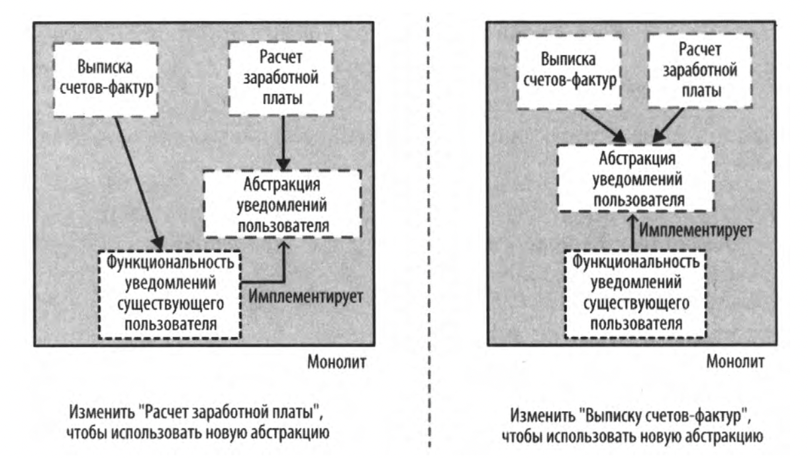

**Как откатывать**: просто переключить интерфейс на вызов кода в монолите

### Параллельное выполнение

Иногда нам может пригодится вызов кода монолита и микросервиса, чтобы убедится, что они дают одинаковый результат.

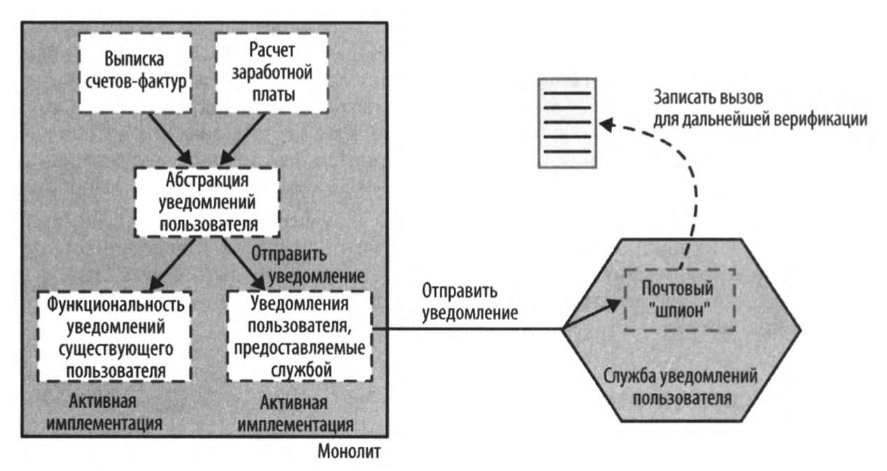

### Сотрудник-декоратор

Иногда бывает удобно не трогать монолит, а просто перехватывать вызов монолита и на подходящий запрос дополнительно делать вызов еще и в микросервис

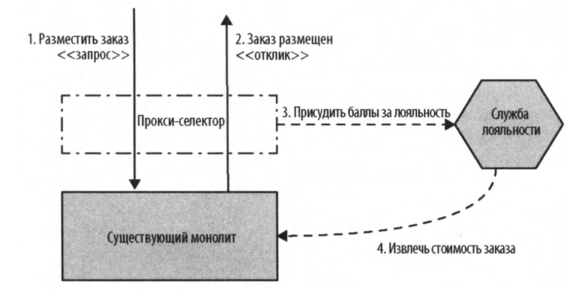

### Монолит как слой доступа к данным

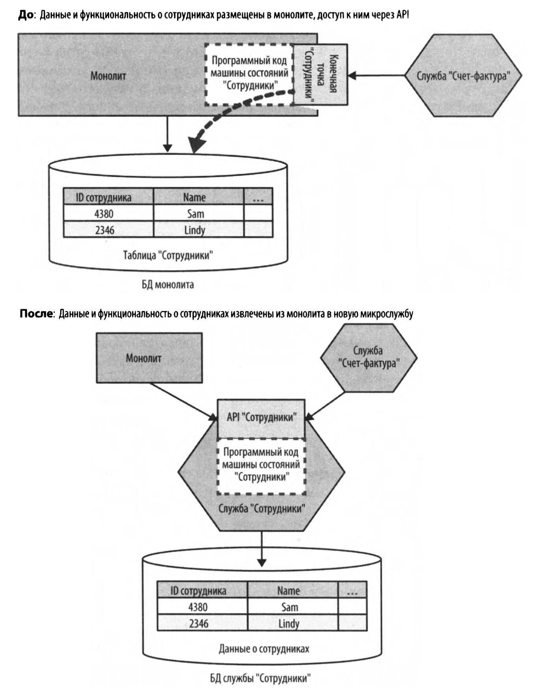

### Мультисхемное хранение

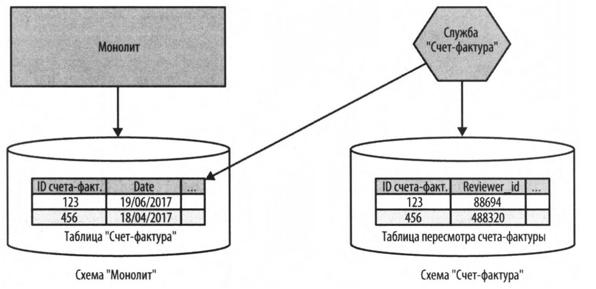

## Шаблоны миграции данных

### Захват изменений в данных

Если наш сервис должен реагировать на изменение данных, мы может воспользоваться захватом изменений в данных, что его вызова.

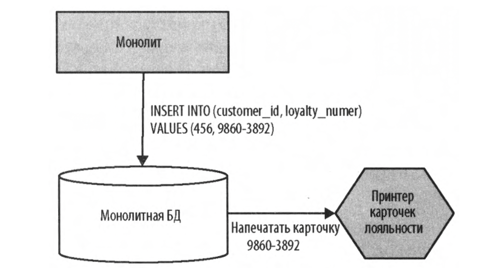

### Совместная база данных

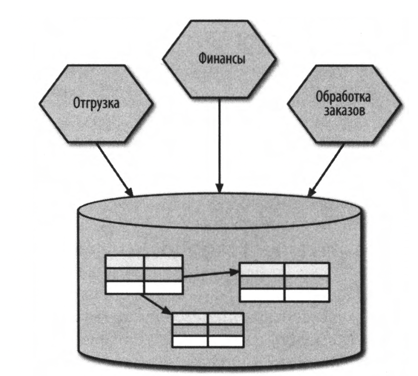

### Проекция базы данных

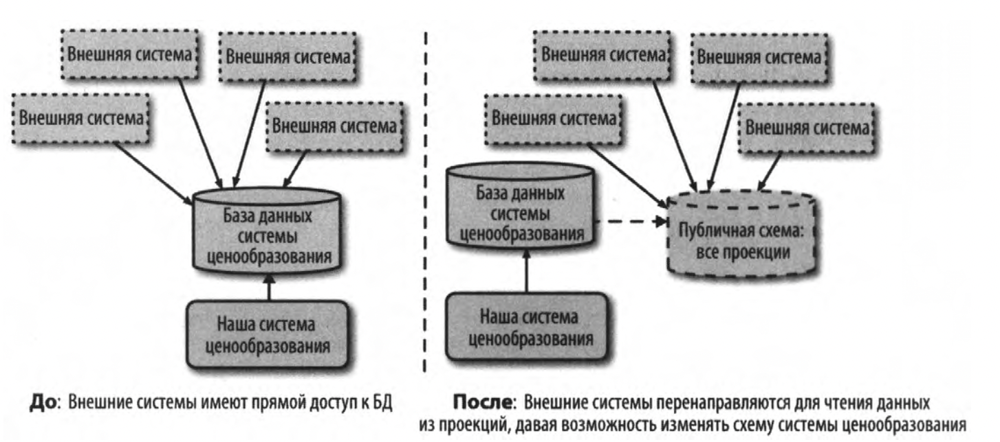

### Служба обертывания базы данных

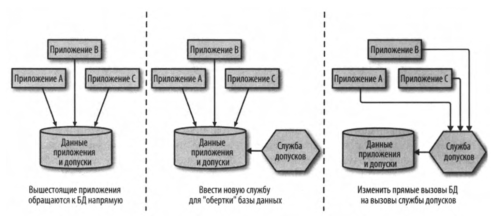

### Интерфейс база-данных-как-служба

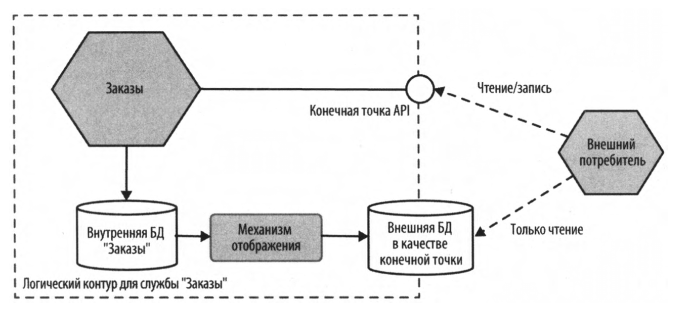

### Монолит с выставлением агрегата наружу

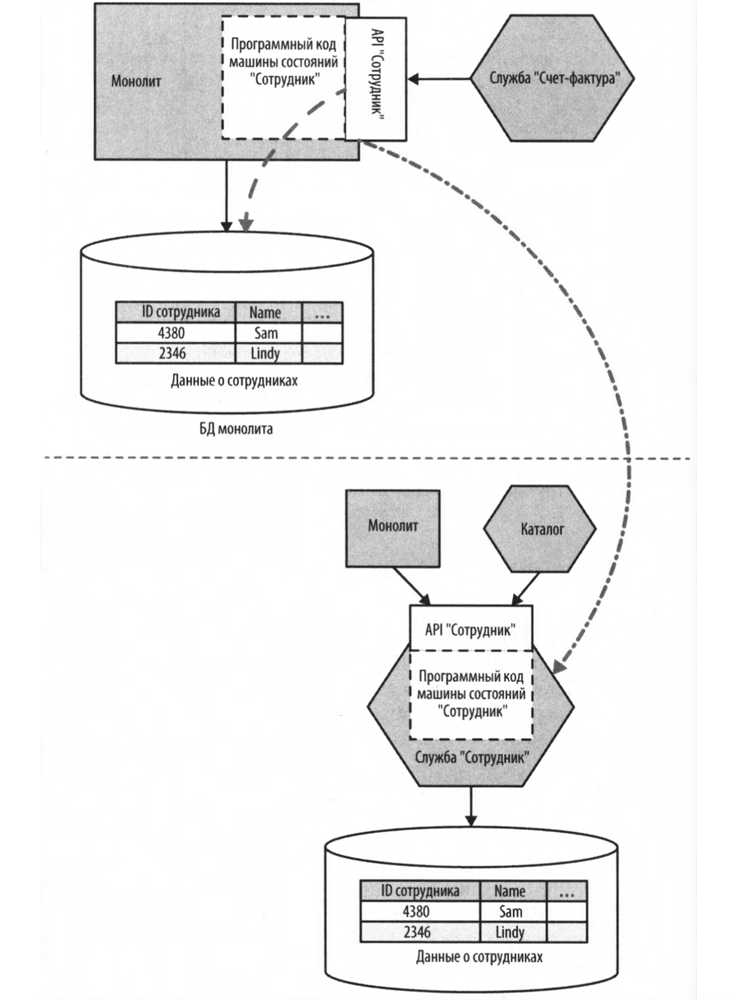

### Смена владельца данных

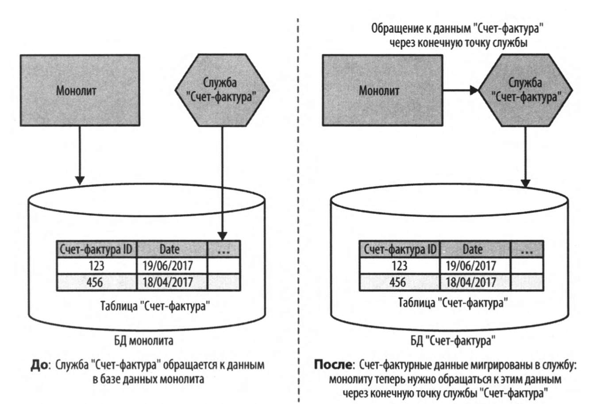

### Синхронизировать данные в приложении

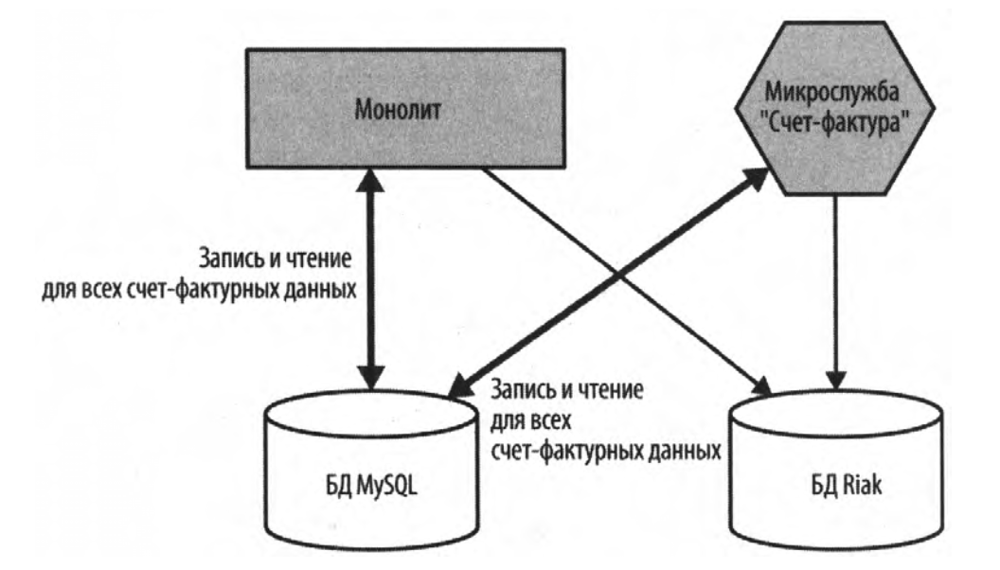

### Разложить таблицу

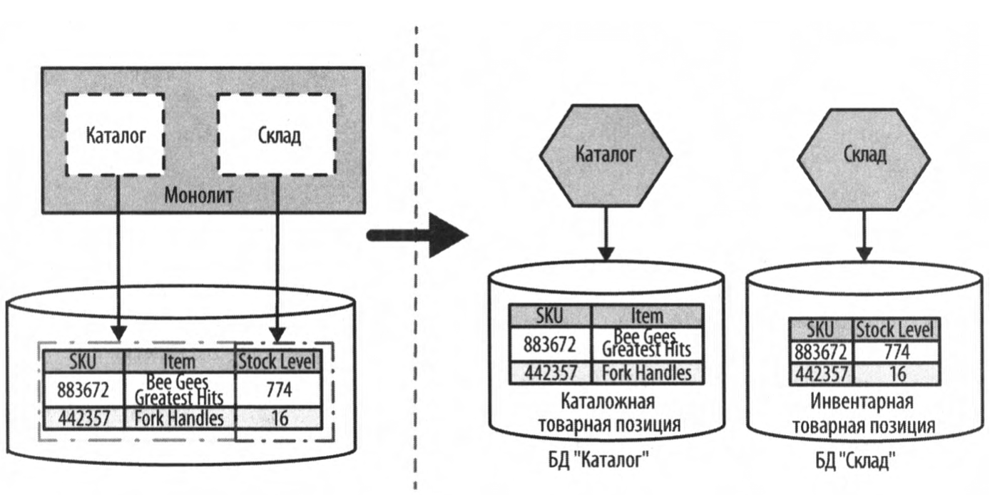

### Консистентность разделенных таблиц
Варианты решения:
- "Перенести связь по внешнему ключу в код"
- не удалять, а помечасть статусом
- может косистентность не так важна?
- не удалять никогда

### Совместные статические данные
Варианты решения:
- "Дублировать статические справочные данные"
- "Выделенная схема справочных данных"
- "Библиотека статических справочных данных"
- "Служба статических справочных данных"

### ACID

Распределенные транзакции — просто скажи "нет"

Используем саги (saga)

- Оркестрированные саги
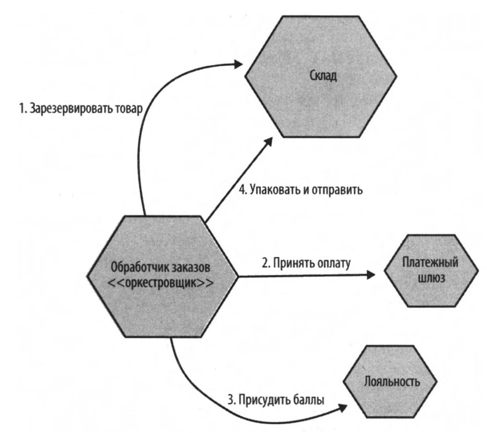
- Хореографированные саги
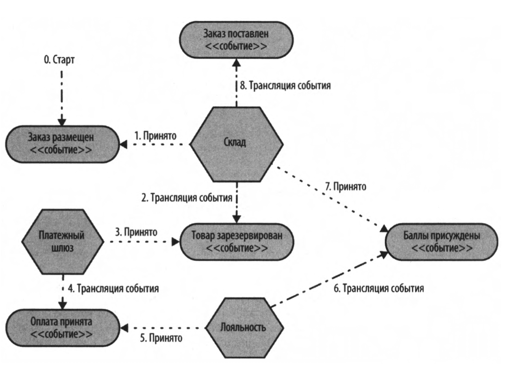

## Рекомендуемая литература
- "Создание микросервисов" Сэм Ньюман
- "Доменно-обусловленный дизайн" Эрик Эванс
- "Основы доменно-обусловленного дизайна" Вон Вернон
- "Мифический человеко-месяц" Фредерик Брукс
- "Введение в событийный штурм" Альберто Брандолини
- "Топологии групп" Мануэль Паис, Мэтью Скелтон
- "Справочник по Devops" Джин Ким, Джез Хамбл и Патрик Дебуа
- "Эффективная работа с унаследованным кодом" Майкл Фитерс
- "Шаблоны интеграции предприятия" Грегора Хоп, Бобби Вулф
- "Рефакторизация баз данных" Скотт Дж. Амблер, Прамод Ж., Садаладж
- "Дизайн приложений с интенсивным использованием данных" Мартин Клеппманн
- "Наблюдаемость распределнных систем" Синди Сридхаран
- "Выпускай!" Майкл Найгард

## Программное обеспечение:
- Camunda, Zeebe - инструменты оркестрации, моделирования бизнес-процессов
- Jaeger - трассировка
- Pact - контракты обусловленные потребителем (consumer-driven contract, CDC)
- telepresence - локальная общение с удаленными подами kubernetes

