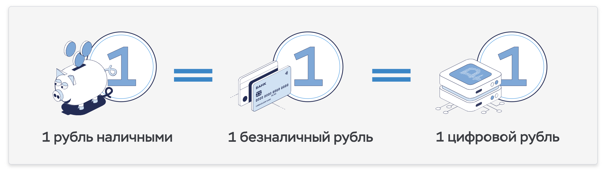

Recently, the Central Bank (CB) of the Russian Federation has carried out a number of changes in laws for the sake of legalizing the **digital ruble** (DR). Legally, the Central Bank will be the third form of money on a par with cash and non-cash rubles. The main question that many people ask is: what is its meaning if cash and non-cash do an excellent job?! Let's figure it out....
<!--truncate-->

The main difference between the Central Bank and all other rubles is that the Central Bank itself keeps records of them, i.e. in fact it will be possible to receive a salary and spend it, bypassing banks, and interacting exclusively with the Central Bank.

## Then why do we need banks?

If the entire exchange can be done without banks, then why do they need them?! Is it possible that over time the Central Bank will simply replace them all?! 

I think it will not replace. Banks, among other things, accumulate the finances of the population through deposits. Why, using this money, they lend businesses at a higher percentage, and keep the difference for themselves. In any case, no one will take away this role of banks.

Then why does the Central Bank need another form of money?

## Transparency for the Central Bank

The financial flows of the Central Bank are visible to the regulator without intermediaries. In the past, after all, the Central Bank requests reports from banks on the flow of funds and draws conclusions based on this. With the digital ruble, another source will be added, which will potentially be more informative (if it becomes popular), and even in real time.

## Control of budget spending

The DR can be limited in the possibility of use. For example, the winner of a tender for a state order can spend this money only on the execution of this order. However, for shady transactions, digital rubles will be transferred to banks under any pretext, from there to cash. Although the scheme of such transactions will become more complicated, it will not completely exclude them. In fact, such restrictions will discourage the desire to commit them for an amount less than a certain value, trying to balance risk and profit.

## Smart Contracts

In a simple purchase and sale, the Central Bank is not much needed. However, if not 2 counterparties participate in the transaction, but 5, or 10, or 50?! It is very difficult to organize such a scheme so that it is somehow convenient. We know that the Sber Bank has such a scheme for mortgages, or crowdlanding platforms. But what if a smart contract is ready on the basis of the digital ruble, which everyone can use?! This will greatly reduce the cost of organizing and supporting such transactions.

## Conclusions

The digital ruble is a new form of money, which, despite its unusual properties, is not the fact that it will benefit, because it will not be possible to maintain such a system for free, and commissions can make it unprofitable for use. The same banks, understanding the competition, can (and many already do) charge interest on the balance of the salary card, which will encourage you to keep money in the bank, and not in an account with the Central Bank. 

As a result, an exciting financial transformation awaits us in the next few years. We will observe.